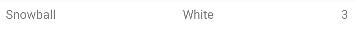
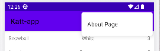
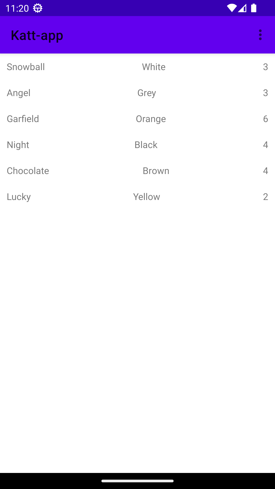
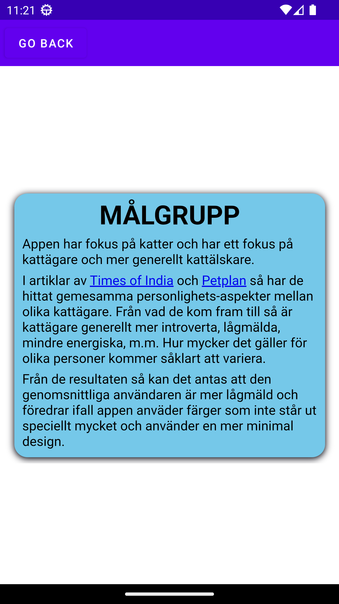

# mobileapp-programming-project
# Skiss


Bild 1: Skiss på MainActivity


Bild 2: Skiss på AboutActivity

# Webbtjänst - JSON
Attributet name används för att lagra namnet på en viss katt.
Category innehåller färgen på en katt. Att använda category för färg passade bäst men passar inte helt 
så attributet kallas "color" i Cat.java klassen.
Attributet size innehåller kattens vikt (i kg). Återigen passade size bäst men det förklarar inte allt
så attributet har döpts om till "weight" i Cat.java klassen.

```
{
    [...]
    "name":"Snowball",
    [...]
    "category":"White",
    "size":3,
    [...]
}
```
Kod 1: Ett JSON objekt från datan. ID, login, och oanvända attribut visas ej

# Implementationsexempel

## Ha med extra data per RecyclerViewItem
I RecyclerViewn så valdes det att visas flera element för att skilja den lite från networking uppgiften. 
För att få det att fungera så skapades först koden som visas i Kod 2. Funktionen bestämmer vad olika views 
i RecyclerViewn ska ha, därför behövs en rad för varje textView (name, weight, & color).

I kod 3 så visas loopen där varje RecyclerViewItem får sin data genom att nya RecyclerViewItems skapas 
med data från det aktuella katt-objektet.

```
@Override
public void onBindViewHolder(ViewHolder holder, int position) {
    holder.name.setText(items.get(position).getName());
    holder.weight.setText(items.get(position).getWeight());
    holder.color.setText(items.get(position).getColor());
}
```
Kod 2: Funktion som lägger in all data i ett RecyclerViewItem

```
for (Cat cat : cats) {
    items.add(new RecyclerItem(cat.getName(), cat.getColor(), cat.getWeight()));
}
```
Kod 3: Loop som lägger till all data i RecyclerViewItems


Bild 3: RecyclerViewItem med flera element


I denna commit dök color och weight upp i recyclerviewn. Problemet var i Cat.java där i @Seralizedname så 
hade size och category skrivits med versaler vilket gjorde att de inte kändes igen i datan.

## Custom toolbar
I appen så valdes det att sätta en meny uppe i toolbaren som går till AboutActivity sidan. För att 
åstadkomma det så sattes först en egen toolbar på toppen av MainActivity. För 
att toolbaren ska fungera så behövs mycket mer kod. I Kod X så visas funktionen som kallas när ett 
menyalternativ väljs. I denna uppgift så laddar den endast About-sidan via intent. I Kod X så visas 
XML-kod för ett alternativ i menyn. Vad alternativet heter bestäms av title attributet och är skrivet 
i strings.xml filen, vilket visas i Kod X. 

Ett oväntat problem som uppståd med detta var att sätta MainActivity som parent till AboutActivity 
inte satte en tillbaka-pil på AboutActivity. För att lösa det så sattes en knapp på AboutActivity som 
öppnar MainActivity via intent.

```
@Override
public boolean onOptionsItemSelected(MenuItem item) {
    Intent intent = new Intent(MainActivity.this, AboutActivity.class);
    startActivity(intent);
    return true;
}
```
Kod 4: Funktion som kallas när ett alternativ väljs

```
<item
    android:id="@+id/action_internal_web"
    android:orderInCategory="110"
    android:title="@string/about_page"
    app:showAsAction="never" />
```
Kod 5: XML för ett alternativ i menyn

```
<resources>
    [...]
    <string name="about_page">About Page</string>
</resources>
```
Kod 6: XML som bestämmer vad som står i alternativet

```
<Button
    android:id="@+id/button"
    android:layout_width="wrap_content"
    android:layout_height="wrap_content"
    android:text="Go back"
    [constraints...]/>
```
Kod 7: Tillbaka-knapp på AboutActivity. 


Bild 4: Bild på Toolbar-menyn


I denna commit så var själva menyn klar. Inget var inlaggt i den men själva menyn fungerade.



